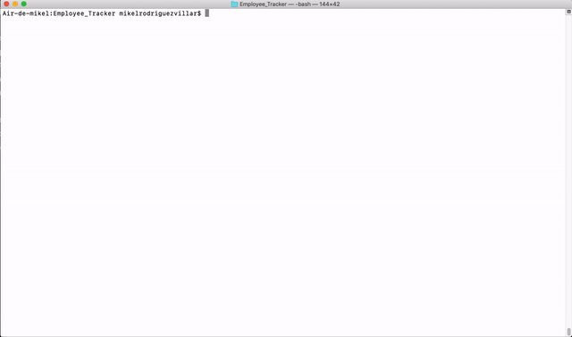

# Employee_Tracker

App for business to be able to view and manage the departments, roles, and employees in their company so that they can organize and plan their business better.

# Technologies Used

1. Node.js
2. MySQL
2. NPM
3. ES6

# Table of Contents

* [Installation](#installation)
* [Instructions](#instructions)
* [Features](#features)
* [Example Gif](#example-gif)
* [Author](#author)

## Installation
> 1.npm init // 2.npm install mysql inquirer // 3.npm install console.table --save

## Instructions
> Open your terminal and go inside the repo where the tracker.js is located. In your terminal type node tracker.js (nodemon tracker.js won't work properly with inquirer list choices). Follow the prompts to interact with the information of your company as desired.

## Features
* View company employees
* View employees by department
* View company departments
* View company job positions
* Add employee
* Add new job position to the company
* Add new department to the company
* Remove employees
* Update employee's role
* View all employees by manager
* Update employee manager
* View budget spent on a specific department

## Example Gif

## Author 

**MikelTafalla**

Email: mikel362d@gmail.com

Location: Santa Barbara

GitHub: https://github.com/MikelTafalla

